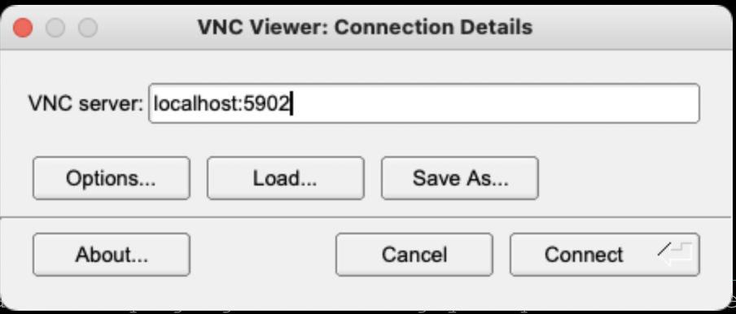
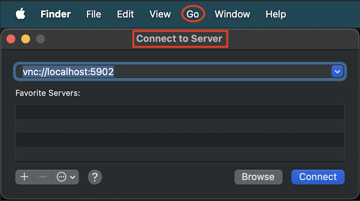

# OCI Shiv
[](https://github.com/cnopslabs/oshiv/actions/workflows/build.yml)

[](https://golang.org)
<a href="https://golang.org"></a>
[](https://raw.githubusercontent.com/cnopslabs/oshiv/main/LICENSE.md)
[](https://goreportcard.com/report/github.com/cnopslabs/oshiv)

A tool for quickly finding OCI resources and connecting to instances and OKE clusters via the bastion service.

## Quick examples

**Finding and connecting to OCI instances**

Search for instances

```
oshiv inst -f foo-node
```
```
Name: my-foo-node-1
Instance ID: ocid1.instance.oc2.us-luke-1.abcdefghijklmnopqrstuvwxyz
Private IP: 123.456.789.5

Name: my-foo-node-2
Instance ID: ocid1.instance.oc2.us-luke-1.bacdefghijklmnopqrstuvwxyz
Private IP: 123.456.789.6
```

Connect via bastion service

```
oshiv bastion -i 123.456.789.5 -o ocid1.instance.oc2.us-luke-1.abcdefghijklmnopqrstuvwxyz
```

**Finding and connecting to Kubernetes clusters**

Search for clusters

```
oshiv -f foo-cluster
```
```
Name: oke-my-foo-cluster
Cluster ID: ocid1.cluster.oc2.us-luke-1.abcdefghijklmnopqrstuvwxyz
Private endpoint IP: 123.456.789.7
Private endpoint port: 6443
```

Connect via bastion service

```
oshiv bastion -y port-forward -k oke-my-foo-cluster -i 123.456.789.7
```

## Install `oshiv`

`oshiv` can be installed either by downloading the binary manually or using [Homebrew](https://brew.sh) for macOS and Linux.

---
### 1. Installation via Homebrew

You can also install `oshiv` using Homebrew (recommended).

#### Steps

1. Add the `cnopslabs/oshiv` tap:
   ```bash
   brew tap cnopslabs/oshiv https://github.com/cnopslabs/oshiv
   ```

2. Install `oshiv`:
   ```bash
   brew install oshiv
   ```

3. Verify the installation:
   ```bash
   oshiv -h
   ```

### 2. Download Binary

You can download the latest binary from the [oshiv releases](https://github.com/cnopslabs/oshiv/releases) page.

### Place the Binary in Your `PATH`

#### macOS/Linux

After downloading the binary, move it to a directory included in your `PATH` (e.g., `/usr/local/bin` or any custom location).

#### Example: Adding Binary to a Custom Path

1. Check your `PATH`:
   ```bash
   echo $PATH
   ```
   Example output:
   ```
   /usr/local/bin:/Users/YOUR_USER/.local/bin
   ```

2. Move the binary to a directory in your `PATH` (e.g., `~/.local/bin`):
   ```bash
   mv ~/Downloads/oshiv ~/.local/bin
   ```

3. For macOS, clear quarantine (if applicable):
   ```bash
   sudo xattr -d com.apple.quarantine ~/.local/bin/oshiv
   ```

4. Make the binary executable:
   ```bash
   chmod +x ~/.local/bin/oshiv
   ```

5. Verify the installation:
   ```bash
   oshiv -h
   ```
---


## Windows Setup

To use `oshiv` on Windows, you need to add its location to the `PATH` environment variable.

### Steps

1. Open **Control Panel** → **System** → **System Settings** → **Environment Variables**.
2. Scroll down in the **System Variables** section and locate the `PATH` variable.
3. Click **Edit** and add the location of your `oshiv` binary to the `PATH` variable. For example, `c:\oshiv`.

   *Note: When adding a new location, ensure that a semicolon (`;`) is included as a delimiter if appending to existing entries. Example: `c:\path;c:\oshiv`.*

4. Launch a new console session to apply the updated environment variable.

---

### Verify Installation

Once the `PATH` is updated, verify the installation by running:

```bash
oshiv -h
```

If the command prints the `oshiv` help information, the setup is complete.

---

## Usage

### Prerequisites

#### 1. OCI Authentication and Authorization

`oshiv` relies on the OCI CLI for authentication and authorization. You can follow Oracle's [Installing the CLI guide](https://docs.oracle.com/en-us/iaas/Content/API/SDKDocs/cliinstall.htm#Quickstart) to set up the OCI CLI.

`oshiv` uses the credentials stored in the `$HOME/.oci/config` file and the OCI profile specified by the `OCI_CLI_PROFILE` environment variable. If the `OCI_CLI_PROFILE` variable is not set, it defaults to the `DEFAULT` profile.

To set a custom OCI profile, use the following command:

```bash
export OCI_CLI_PROFILE=MYCUSTOMPROFILE
```
Replace `MYCUSTOMPROFILE` with the name of your desired OCI profile.

---

With these steps completed, you’re ready to use `oshiv` for managing and connecting to OCI instances.

#### 2. OCI Tenancy

`oshiv` will attempt to determine tenancy in this order:

1. Attempt to get tenancy ID from `OCI_CLI_TENANCY` environment variable. (E.g. `export OCI_CLI_TENANCY=ocid1.tenancy.oc2..`)

2. Attempt to get tenancy ID from `-t` flag

3. Attempt to get tenancy ID from OCI config file (`$HOME/.oci/config`)

Patterns `#1` and `#2` above allow you to override your default tenancy.

### Defaults

#### 1. SSH keys

By default, `oshiv` looks for the `id_rsa` and `id_rsa.pub` key pair in `$HOME/.ssh`. You can override the directory of your `id_rsa` and `id_rsa.pub` key pair by setting the `OSHIV_SSH_HOME` environment variable. 

Example: 

```
export OSHIV_SSH_HOME=$HOME/.ssh/oshiv
ssh-keygen -t rsa -b 4096 -C "oshiv@oraclecloud.com" -f $OSHIV_SSH_HOME/id_rsa
```

Individual keys can be overwritten by passing the the following flags:

- `-a`, `--private-key` Path to SSH private key (identity file)
- `-e`, `--public-key` Path to SSH public key

See `oshiv bastion -h` for more detail.

#### 2. SSH user

By default, `oshiv` uses the `opc` user. This can be overriden by flags. See `oshiv bastion -h`

#### 3. SSH port

By default, `oshiv` uses port `22` user. This can be overriden by flags. See `oshiv -h`

*Note: This is the port used to SSH to the bastion host and subsequently the target host. Not to be confused with the local/remote ports used for tunneling.*

### Common usage patterns

List compartments

```
oshiv compart -l

COMPARTMENTS:
fakecompartment1
dummycompartment2
mycompartment

To set compartment, run:
   oshiv compartment -s COMPARTMENT_NAME
```

Set compartment

```
oshiv compartment -s MyFooCompartment
```

Find instance

```
oshiv inst -f mydatabase

Name: mydatabase-1
Instance ID: ocid1.instance.oc2.us-luke-1.abcdefghijklmnopqrstuvwxyz
Private IP: 123.456.789.5

Name: mydatabase-2
Instance ID: ocid1.instance.oc2.us-luke-1.bacdefghijklmnopqrstuvwxyz
Private IP: 123.456.789.6
```

Create bastion session to connect to instance

```
oshiv inst -i 123.456.789.5 -o ocid1.instance.oc2.us-luke-1.abcdefghijklmnopqrstuvwxyz
```

Connect to instance

`oshiv` will produce various SSH commands to connect to your instance

```
Tunnel:
sudo ssh -i "/Users/myuser/.ssh/id_rsa" \
-o StrictHostKeyChecking=no -o UserKnownHostsFile=/dev/null \
-o ProxyCommand='ssh -i "/Users/myuser/.ssh/id_rsa" -W %h:%p -p 22 ocid1.bastionsession.oc2.us-luke-1.abcdefghijklmnopqrstuvwxyz@host.bastion.us-luke-1.oci.oraclegovcloud.com' \
-P 22 opc@123.456.789.5 -N -L <LOCAL PORT>:123.456.789.5:<REMOTE PORT>

SCP:
scp -i /Users/myuser/.ssh/id_rsa -o StrictHostKeyChecking=no -o UserKnownHostsFile=/dev/null -P 22 \
-o ProxyCommand='ssh -i /Users/myuser/.ssh/id_rsa -W %h:%p -p 22 ocid1.bastionsession.oc2.us-luke-1.abcdefghijklmnopqrstuvwxyz@host.bastion.us-luke-1.oci.oraclegovcloud.com' \
<SOURCE PATH> opc@123.456.789.5:<TARGET PATH>

SSH:
ssh -i /Users/myuser/.ssh/id_rsa -o StrictHostKeyChecking=no -o UserKnownHostsFile=/dev/null \
-o ProxyCommand='ssh -i /Users/myuser/.ssh/id_rsa -W %h:%p -p 22 ocid1.bastionsession.oc2.us-luke-1.abcdefghijklmnopqrstuvwxyz@host.bastion.us-luke-1.oci.oraclegovcloud.com' \
-P 22 opc@123.456.789.5
```

Or find OKE cluster and create bastion session to connect to the Kubernetes API

```
oshiv oke -f oke-my-foo-cluster
```

```
oshiv bastion -y port-forward -k oke-my-foo-cluster -i 123.456.789.7
```

7. Connect to cluster

`oshiv` will produce an SSH command to allow port forwarding connectivity to your cluster. It will also produce an oci cli commands to update your Kubernetes config file with the OKE cluster details (this only needs to be performed once).

```
Update kube config (One time operation):
oci ce cluster create-kubeconfig --cluster-id ocid1.cluster.oc2.us-luke-1.abcdefghijklmnopqrstuvwxyz --token-version 2.0.0 --kube-endpoint 123.456.789.7

Port Forwarding command:
ssh -i /Users/myuser/.ssh/id_rsa -o StrictHostKeyChecking=no -o UserKnownHostsFile=/dev/null \
-p 22 -N -L 6443:123.456.789.7:6443 ocid1.bastionsession.oc2.us-luke-1.abcdefghijklmnopqrstuvwxyz@host.bastion.us-luke-1.oci.oraclegovcloud.com
```

You should now be able to connect to your cluster's API endpoint using tools like `kubectl` and `k9s`.

### Tunneling examples

#### VNC (Linux GUI)

```
sudo ssh -i "/Users/myuser/.ssh/id_rsa" \
-o StrictHostKeyChecking=no -o UserKnownHostsFile=/dev/null \
-o ProxyCommand='ssh -i "/Users/myuser/.ssh/id_rsa" -W %h:%p -p 22 ocid1.bastionsession.oc2.us-luke-1.abcdefghijklmnopqrstuvwxyz@host.bastion.us-luke-1.oci.oraclegovcloud.com' \
-P 22 opc@123.456.789.5 -N -L 5902:123.456.789.5:5902
```

Now you should be able to connect (via localhost) using a VNC client. 

For MacOS, I recommend [TigerVNC](https://tigervnc.org/) but the built-in VNC client will work as well.

```
localhost:5902
```





#### RDP (Windows)

```
sudo ssh -i "/Users/myuser/.ssh/id_rsa" \
-o StrictHostKeyChecking=no -o UserKnownHostsFile=/dev/null \
-o ProxyCommand='ssh -i "/Users/myuser/.ssh/id_rsa" -W %h:%p -p 22 ocid1.bastionsession.oc2.us-luke-1.abcdefghijklmnopqrstuvwxyz@host.bastion.us-luke-1.oci.oraclegovcloud.com' \
-P 22 opc@123.456.789.5 -N -L 3389:123.456.789.5:3389
```

Now you should be able to connect via localhost with an RDP client

### Help (all options)

```
oshiv -h
```

```
A tool for finding and connecting to OCI resources via the bastion service

Usage:
  oshiv [flags]
  oshiv [command]

Available Commands:
  bastion     Find, list, and connect to resources via the OCI bastion service
  compartment Find and list compartments
  completion  Generate the autocompletion script for the specified shell
  config      Display oshiv configuration
  db          Find and list databases
  help        Help about any command
  image       Find and list OCI compute images
  info        Display your custom OCI tenancy information
  instance    Find and list OCI instances
  oke         Find and list OKE clusters
  policy      Find and list policies by name or statement
  subnet      Find and list subnets
  version     Print the version number of oshiv CLI

Flags:
  -c, --compartment string   The name of the compartment to use
  -h, --help                 help for oshiv
  -t, --tenancy-id string    Override's the default tenancy with this tenancy ID
  -v, --version              Print the version number of oshiv CLI
```

### Info

The `info` command displays custom tenancy info that you define in your tenancy info file located at `$HOME/.oci/tenancy-map.yaml`. This is helpful to quickly display the tenancy and compartment info necessary to run most oshiv commands.

[tenancy-map.yaml example](examples/tenancy-map.yml)


## Contribute

Style guide: https://go.dev/doc/effective_go

### Build

```
make build
```

### Test and push

Test/validate changes, push to your fork, make PR

### Release

```
git tag -a <VERSION> -m '<COMMENTS>'
make release
```

```
git push origin <VERSION>
```

Verify the [releaser](https://github.com/cnopslabs/oshiv/actions/workflows/releaser.yml) job completes successfully

## Future enhancements and updates

- Add tests!
- Add search capability for NSG rules
- Generate and use ephemeral SSH keys
- Use logging library
- When creating a bastion session, only require IP address or instance ID (and lookup the other)
- Manage SSH client
  - https://pkg.go.dev/golang.org/x/crypto/ssh
- Manage SSH keys
  - https://pkg.go.dev/crypto#PrivateKey

## Troubleshooting

If oshiv gets quarantined by your OS

```
sudo xattr -d com.apple.quarantine PATH_TO_OSHIV
```

example

```
sudo xattr -d com.apple.quarantine ~/.local/bin/oshiv
```

## Reference

https://docs.oracle.com/en-us/iaas/tools/go/65.78.0/
